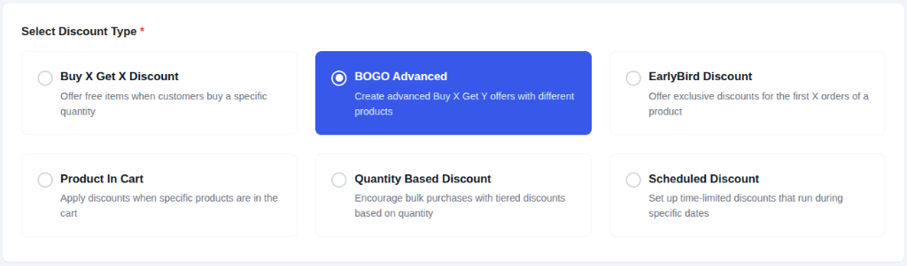
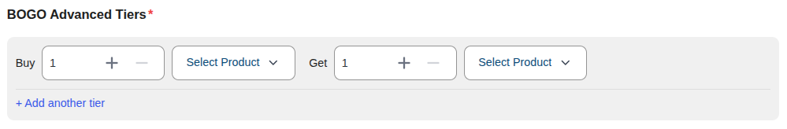
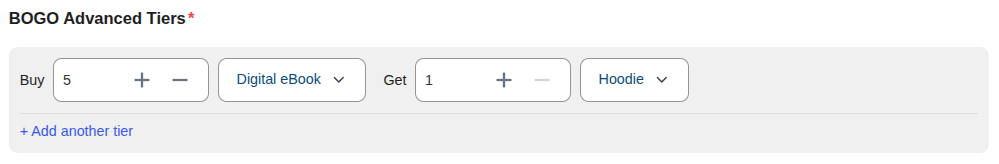
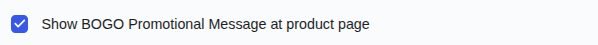
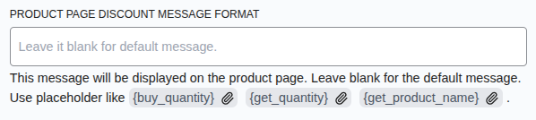
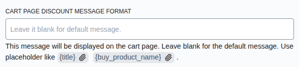
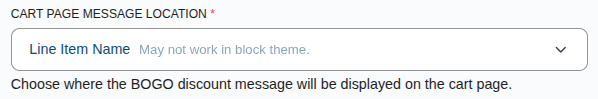

# Campaign Type: BOGO Advanced (Buy X Get Y)

::: tip Pro Feature
This is a **CampaignBayPro** feature. [Upgrade to Pro](https://wpanchorbay.com/campaignbay) to unlock BOGO Advanced and other powerful features.
:::

A **BOGO Advanced (Buy X, Get Y)** discount is a powerful upgrade to the standard BOGO campaign. While the standard BOGO requires the customer to buy and get the _same_ product (Buy T-Shirt, Get T-Shirt), the Advanced version deals with _different_ products.

This is perfect for cross-selling and bundling scenarios like:

- "Buy a **Laptop**, Get a **Mouse** for Free"
- "Buy 2 **Jeans**, Get a **Belt** at 50% Off"

## Step 1: Select Your Campaign Type

To begin, navigate to **CampaignBay → Add Campaign**.

- **Select Discount Type:** Choose **`BOGO Advanced`** from the list of available campaign types. This will unlock the specific configuration fields for Buy X Get Y offers.

- **Campaign Title:** Give your campaign a descriptive name (e.g., "Free Mouse with Laptop Bundle"). This name will appear in the "All Campaigns" list and can be used in your cart messages using the `{title}` placeholder.

- **Set Status:** Ensure the status is set to **Active** to make the campaign live immediately upon saving.

## Step 2: Define the BOGO Tiers

This is where you define the "Buy X Get Y" logic. You can create multiple tiers to encourage bulk purchases.

### Configuration Fields

1.  **Buy Quantity:** Enter how many items the customer must purchase to trigger the deal.
2.  **Buy Product:** Select the specific product the customer must purchase.
3.  **Get Quantity:** Enter how many of the "Get Product" they will receive.
4.  **Get Product:** Select the product the customer will receive as a discount.

### Example: The "Laptop Bundle"

You want to give a free mouse with every laptop purchase.

- **Buy Product:** Laptop Pro X
- **Buy Quantity:** 1
- **Get Product:** Wireless Mouse
- **Get Quantity:** 1

When a customer adds **1 Laptop Pro X** to their cart, the system will automatically add **1 Wireless Mouse** to the cart for free (depending on your display settings).

## Step 3: Set Conditions (Optional)

You can add specific rules to restrict who can use this discount.

**[Read the Full Guide: How to Use Conditions &rarr;](../core-concepts/conditions.md)**

## Step 4: Set Other Configurations (Optional)

This section provides additional rules for your campaign.

- **Exclude Sale Items:** Check this box if you do not want this campaign's discount to apply to products that are already on sale in WooCommerce. This is useful for preventing "double discounting."

- **Enable Usage Limit:** Check this box to set a maximum number of times this campaign can be used across your entire store. Once the limit is reached, the campaign will automatically become inactive.

## Step 5: Set the Schedule (Optional)

For a Scheduled Discount, setting the duration is essential. This section controls when your campaign will automatically start and end.

- **Start Time / End Time:** Use the date and time pickers to set the exact moment for the campaign to activate and expire.

::: tip Timezone Information
All dates and times are based on the timezone you have configured in your main WordPress settings under **Settings → General → Timezone**. The system automatically handles all UTC conversions for you.
:::

::: info Learn More About Automation
The status of your campaign is closely tied to the scheduling system, which uses WordPress Cron to automate activation and expiration.

**[Read the Full Guide: Scheduling & Automation &rarr;](../core-concepts/scheduling-and-automation.md)**
:::

## Step 6: Display Configurations

- **Automatically Add Free Product To Cart:**
  - **Checked (Recommended):** The "Get Product" acts as a gift and is auto-added.
  - **Unchecked:** The customer must manually add the "Get Product" to their cart to see the discount.

### Messaging Options

- **Show BOGO Promotional Message at product page:** Toggle this to enable or disable the custom message on the product page.

- **Product Page Discount Message Format:** Enter a message to display on the product page. Use placeholders like `{buy_quantity}`, `{get_quantity}`, and `{get_product_name}` to inform customers about the deal.

- **Cart Page Discount Message Format:** Enter a message to display in the cart. You can use `{title}` for the campaign name and `{buy_product_name}` to specify what they bought.

- **Cart Page Message Location:** Choose where the cart message should appear (e.g., next to the line item name).

## Step 7: Save the Campaign

Once you have configured all the options, click the **Save Campaign** button. You will be redirected to the "All Campaigns" list.

Next, learn how to offer discounts based on other products in the cart.

- **[Product In Cart &rarr;](./product-in-cart-discounts.md)**
