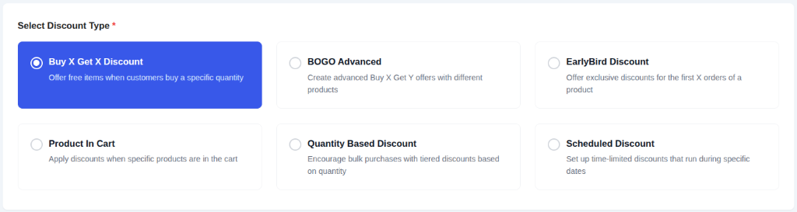
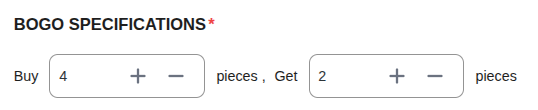
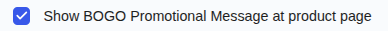
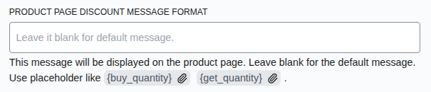
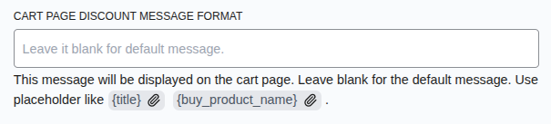
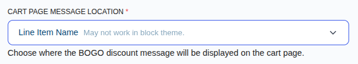

# Campaign Type: BOGO Discount (Buy X Get X)

A **BOGO (Buy One, Get One)** discount is a popular promotional tool that rewards customers with free or discounted items when they purchase a specific quantity of a product. This guide covers the **"Buy X Get X"** type, where the item the customer "gets" is the same as the item they "buy".

This is the perfect campaign type for scenarios like:

- "Buy 2 T-Shirts, Get 1 Free"
- "Buy 3, Get 1 Free" on specific items.

This guide will walk you through every field required to set up this campaign type.

## Step 1: Select Your Campaign Type

To begin, navigate to **CampaignBay → Add Campaign**.

- **Select Discount Type:** Choose **`Buy X Get X`** from the list. This will reveal the configuration fields for the standard BOGO offer, where the "Buy" item and the "Get" item are the same.

- **Campaign Title:** Give your campaign a clear and descriptive name (e.g., "Hoodie BOGO Deal").

- **Select Status:**
  - **Active:** The campaign will be live as soon as its start time is reached.
  - **Inactive:** The campaign will be saved as a draft.

## Step 2: Set the Discount Target

This crucial step defines which products in your store are eligible for the BOGO offer.

The **DISCOUNT TARGET** dropdown provides options to apply the offer to your entire store, specific products, or categories.

::: info Learn More About Targeting
The "Discount Target" setting is a powerful feature shared by all campaign types. We've created a dedicated guide to explain all of its options and conditional fields in detail.

**[Read the Full Guide: Targeting &rarr;](../core-concepts/targeting.md)**
:::

## Step 3: Define the BOGO Rule

This is the core logic of your campaign.

- **Buy X pieces:** Enter the number of items the customer needs to purchase to trigger the offer (e.g., `2`).
- **Get Y pieces:** Enter the number of items the customer will receive for free (e.g., `1`).

::: tip How it works
If you set **Buy 2 Get 1**, and a customer adds 3 items to their cart, the cheapest one will be free. If they add 6 items, the 2 cheapest ones will be free.
:::

## Step 4: Set Conditions (Optional)

You can add specific rules to restrict who can use this discount (e.g., specific User Roles).

**[Read the Full Guide: How to Use Conditions &rarr;](../core-concepts/conditions.md)**

## Step 5: Set Other Configurations (Optional)

This section provides additional rules for your campaign.

- **Exclude Sale Items:** Check this box if you do not want this campaign's discount to apply to products that are already on sale in WooCommerce. This is useful for preventing "double discounting."

- **Enable Usage Limit:** Check this box to set a maximum number of times this campaign can be used across your entire store. Once the limit is reached, the campaign will automatically become inactive.

## Step 6: Set the Schedule (Optional)

You can optionally schedule your campaign to run during a specific time window. This section controls when your campaign will automatically start and end.

- **Start Time / End Time:** Use the date and time pickers to set the exact moment for the campaign to activate and expire.

::: tip Timezone Information
All dates and times are based on the timezone you have configured in your main WordPress settings under **Settings → General → Timezone**. The system automatically handles all UTC conversions for you.
:::

::: info Learn More About Automation
The status of your campaign is closely tied to the scheduling system, which uses WordPress Cron to automate activation and expiration.

**[Read the Full Guide: Scheduling & Automation &rarr;](../core-concepts/scheduling-and-automation.md)**
:::

## Step 7: Define Display Configurations

This section is unique to BOGO campaigns and controls how the offer is communicated and applied.

- **Automatically Add Free Product To Cart:** This is a powerful user experience feature.
  - **If checked:** When a customer adds the "Buy Amount" (e.g., 2 items), the free "Get Quantity" (e.g., 1 item) will be **automatically added to their cart at no cost**.
  - **If unchecked:** The customer must manually add the total quantity to their cart (e.g., 3 items). The plugin will then automatically apply a discount equal to the price of the "Get Quantity" (1 item).

### Messaging Options

- **Show BOGO Promotional Message at product page:** Toggle this to enable or disable the custom message on the product page.

- **Product Page Discount Message Format:** Enter a message to display on the product page. Use placeholders like `{buy_quantity}` and `{get_quantity}`.
  - _Example:_ `Buy {buy_quantity} and get {get_quantity} free!`

- **Cart Page Discount Message Format:** Enter a message to display in the cart. Use `{title}` to show the campaign name.
  - _Example:_ `Discount '{title}' has been applied!`

- **Cart Page Message Location:** Choose where the cart message should appear (e.g., next to the line item name).

## Step 8: Save the Campaign

Once you have configured all the options, click the **Save Campaign** button. You will be redirected to the "All Campaigns" list where you can see your new BOGO offer.

Next, learn how to create advanced BOGO deals where product X gives product Y.

- **[BOGO Advanced (Buy X Get Y) &rarr;](./bogo-advanced-discounts.md)**
