# Campaign Type: Early Bird Discount

An **Early Bird Discount** is a powerful marketing tool designed to create urgency and drive rapid sales by rewarding your first customers. The discount is based on the total number of **successful orders** that have already used the campaign.

This is the perfect campaign type for scenarios like:

- "50% off for the first 100 customers!"
- "Launch Special: The first 50 orders get $20 off, the next 100 get $10 off."
- Creating a flash sale with a limited number of available slots.

::: warning Important: Order vs. Quantity
An Early Bird discount is based on the number of **orders**, not the quantity of items purchased. If one customer buys 100 items in a single transaction, it only counts as **one** use toward the campaign's limit.
:::

This guide will walk you through every field required to set up this campaign type.

## Step 1: Select Your Campaign Type

To begin, navigate to **CampaignBay → Add Campaign**.

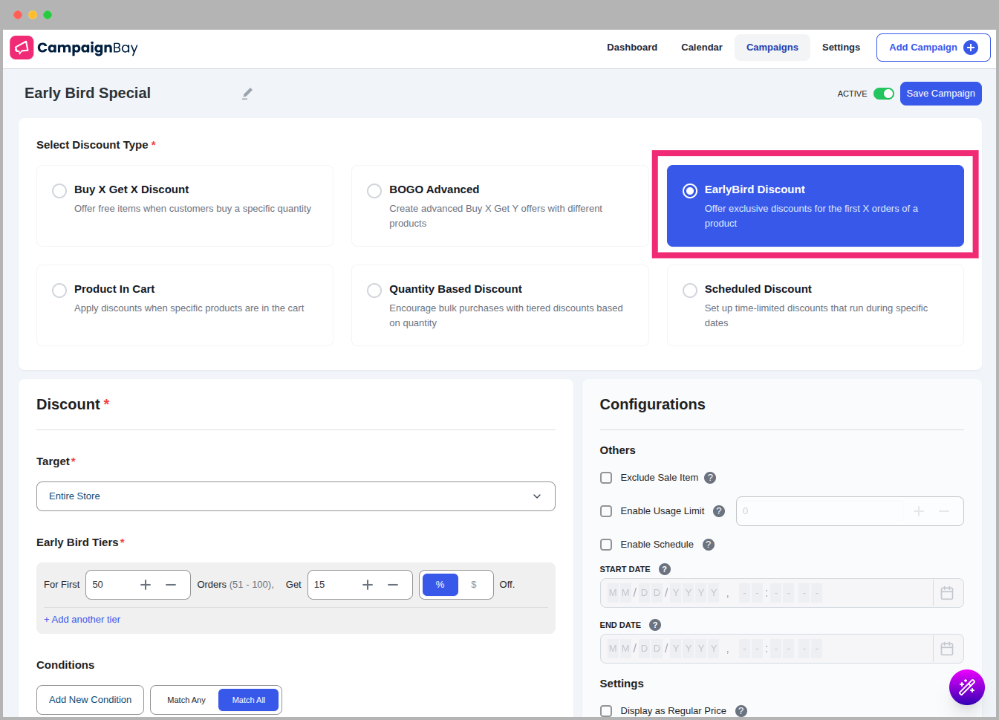

- **Select Discount Type:** Choose **`EarlyBird Discount`** from the list. This will reveal the tiered configuration for rewarding your first customers.

- **Campaign Title:** Give your campaign a clear and descriptive name (e.g., "New Product Launch Offer").

- **Select Status:**
  - **Active:** The campaign will be live immediately (or on its scheduled start time).
  - **Inactive:** Save the campaign as a draft.

## Step 2: Set the Discount Target

This crucial step defines which products in your store are eligible for the early bird discount.

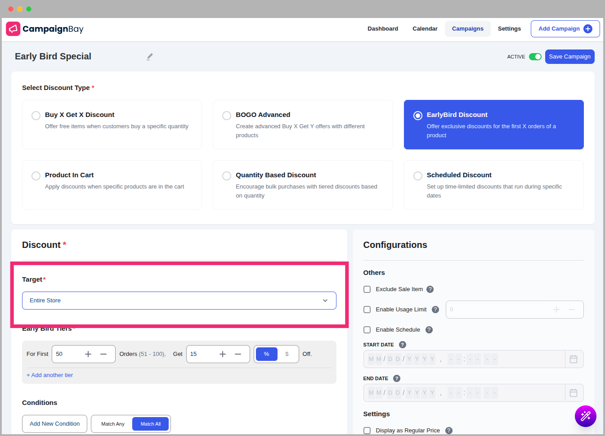

The **DISCOUNT TARGET** dropdown provides powerful options to control the scope of your campaign, such as applying it to the entire store, specific products, or categories.

::: info Learn More About Targeting
The "Discount Target" setting is a powerful feature shared by all campaign types. We've created a dedicated guide to explain all of its options and conditional fields in detail.

**[Read the Full Guide: Targeting &rarr;](../core-concepts/targeting.md)**
:::

## Step 3: Define Discount Tiers For First Sales

This is the core of the Early Bird Discount. Here you will define the tiers based on the number of successful orders.

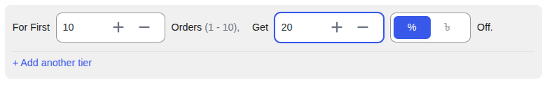

- **For First:** Enter the number of orders for this tier. For example, entering `10` here means this tier applies to the first 10 successful orders.
- **Orders (e.g., 1 - 10):** This label automatically updates to show the range of orders covered by this tier.
- **Get:** The numeric value of the discount.
- **% / Fixed ($) (Mode):** The type of discount to apply (Percentage or Fixed Currency amount).

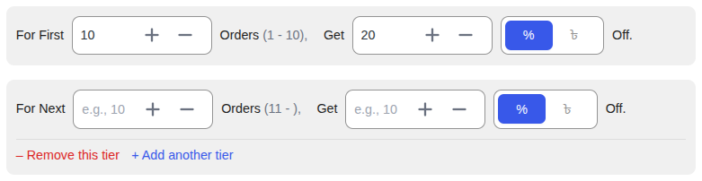

- **+ Add another tier:** Click this to add multiple levels of Early Bird offers (e.g., "For Next 10 Orders..."). Each subsequent tier will automatically pick up where the previous one left off.

### How Tiers Work

The tiers work sequentially from top to bottom.

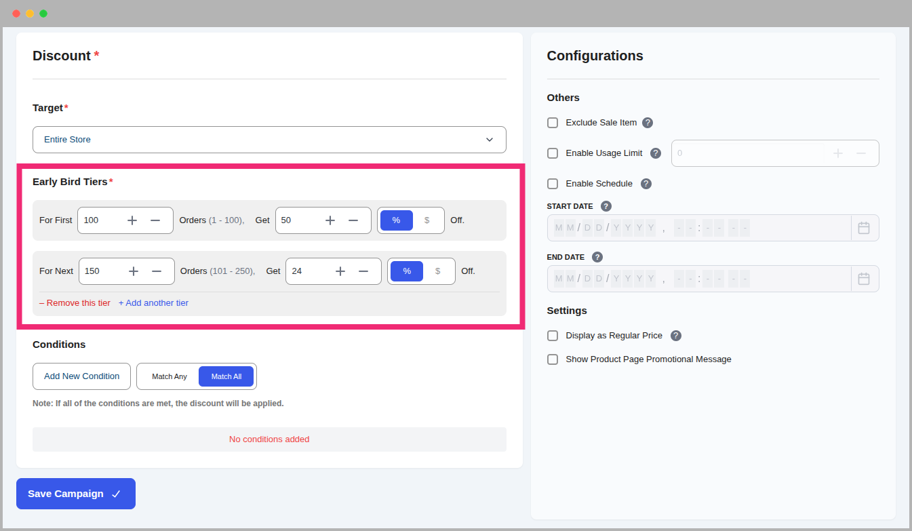

**Example Tier Setup:**

- **Tier 1:** For First `100 Sales (1 - 100)`, give `50` `%`
- **Tier 2:** For Next `150 Sales (101 - 250)`, give `25` `%`

**In this scenario:**

- Orders 1 through 100 will receive a 50% discount.
- Orders 101 through 250 will receive a 25% discount.
- Order 251 and beyond will receive no discount from this campaign.

## Step 4: Set Conditions (Optional)

You can add specific rules to restrict who can use this discount (e.g., specific User Roles).

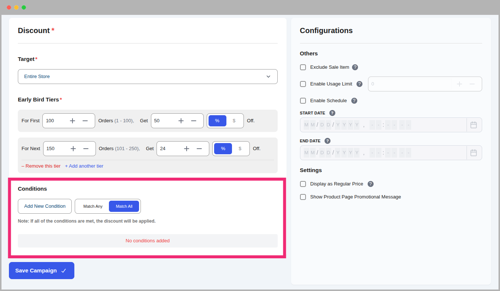

**[Read the Full Guide: How to Use Conditions &rarr;](../core-concepts/conditions.md)**

## Step 5: Set Other Configurations (Optional)

This section provides additional rules for your campaign.

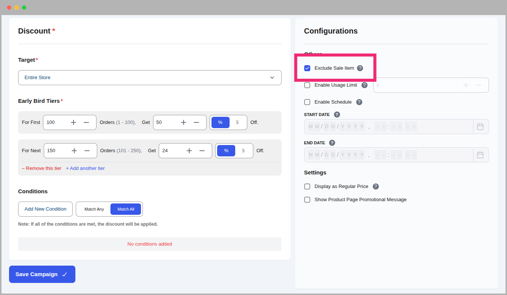

- **Exclude Sale Items:** Check this box if you do not want this campaign's discount to apply to products that are already on sale in WooCommerce. This is useful for preventing "double discounting."

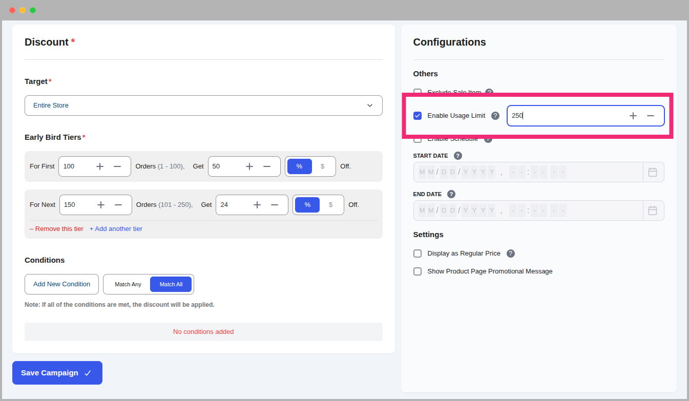

- **Enable Usage Limit:** Check this box to set a maximum number of times this campaign can be used across your entire store. Once the limit is reached, the campaign will automatically become inactive.

## Step 6: Set the Schedule (Optional)

You can optionally schedule your campaign to run during a specific time window. This section controls when your campaign will automatically start and end.

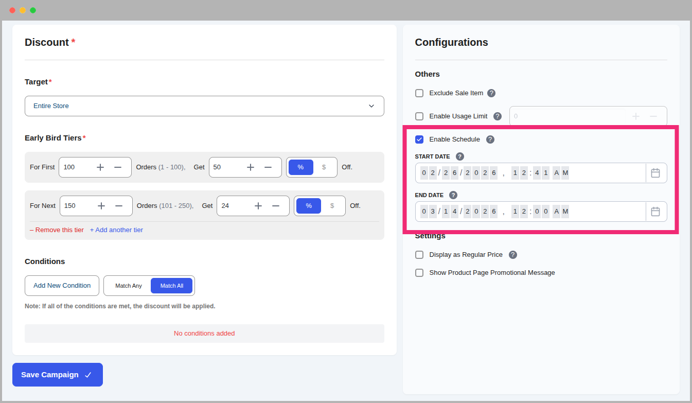

- **Start Time / End Time:** Use the date and time pickers to set the exact moment for the campaign to activate and expire.

::: tip Timezone Information
All dates and times are based on the timezone you have configured in your main WordPress settings under **Settings → General → Timezone**. The system automatically handles all UTC conversions for you.
:::

::: info Learn More About Automation
The status of your campaign is closely tied to the scheduling system, which uses WordPress Cron to automate activation and expiration.

**[Read the Full Guide: Scheduling & Automation &rarr;](../core-concepts/scheduling-and-automation.md)**
:::

## Step 7: Display Configurations

This section controls how the offer is communicated to the customer, both on the product page and in their cart.

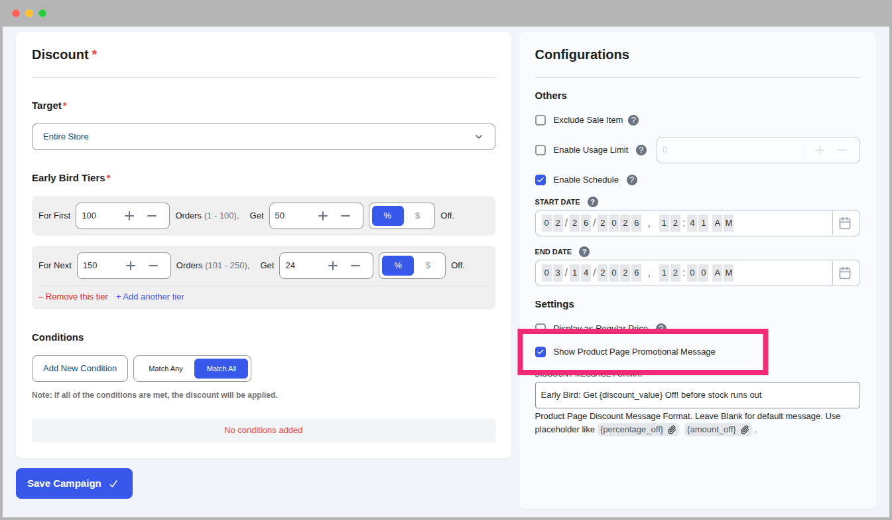

- **Show Product Page Promotional Message:** Toggle this to enable or disable the custom message on the product pages.

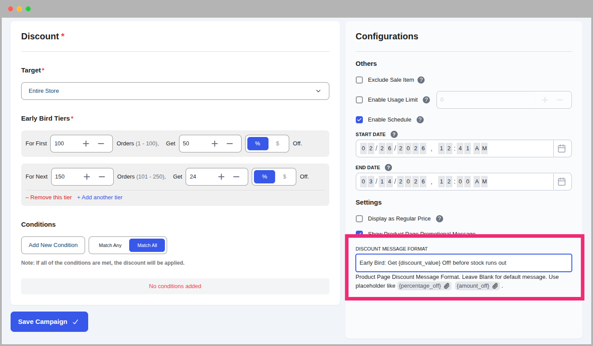

- **Product Page Discount Message Format:** Customize the promotional text using placeholders like `{percentage_off}` or `{amount_off}`.
  - _Example:_ `Early Bird Special! Get {percentage_off}% off for a limited time!`

- **Cart Page Discount Message Format:** Enter a message to display on the cart page when the discount is applied.
  - _Example:_ `Early Bird discount applied: {discount_amount}`

- **Cart Page Message Location:** Choose where the cart message should appear (e.g., next to the line item name).

## Step 8: Save the Campaign

Once you have configured all the options, click the **Save Campaign** button at the top right of the page. After saving, you will be redirected back to the "All Campaigns" list.

## Next Steps

Next, learn how to create campaigns that offer "Buy One, Get One" style deals.

- **[Creating a BOGO Discount &rarr;](./bogo-discounts.md)**
