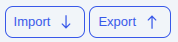
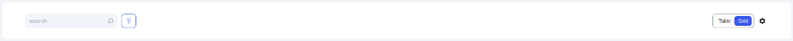
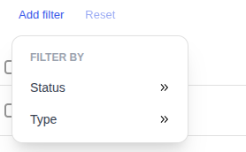
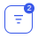
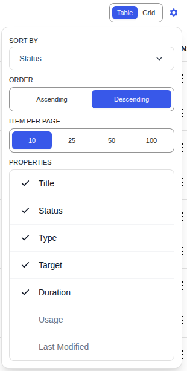
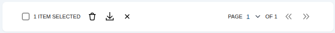

# All Campaigns

The **All Campaigns** page is your central hub for managing and organizing all discount campaigns. View, filter, sort, and perform actions using either a detailed **Table View** or a visual **Grid View**.

---

## Import & Export

Quickly migrate or backup your campaigns:

- **Import:** Upload a CSV file to restore campaigns from another site or backup
- **Export:** Download all campaigns as CSV for backup or migration

---

## Toolbar

The toolbar provides instant search, filtering, and view switching.

### Search

Start typing a campaign name to instantly filter results.

### Filtering

Click the filter icon to open advanced filtering options:

Filter by **Status** (Active, Inactive) or **Type** (Scheduled, Quantity, BOGO, etc.).

Active filters appear as removable pills:

The filter icon shows a badge indicating how many filters are active:

### View Toggle & Settings

Click the gear icon to access display settings:

| Setting            | Options                      |
| ------------------ | ---------------------------- |
| **Sort By**        | Status, Title, Type, etc.    |
| **Order**          | Ascending / Descending       |
| **Items Per Page** | 10, 25, 50, 100              |
| **Properties**     | Toggle which columns to show |

---

## Table View

A dense, data-rich list with sortable columns:

| Column            | Description                             |
| ----------------- | --------------------------------------- |
| **Title**         | Campaign name (click to edit)           |
| **Status**        | Active/Inactive indicator               |
| **Type**          | Scheduled, Quantity, BOGO, etc.         |
| **Target**        | All Products, Selected Categories, etc. |
| **Duration**      | Start and end dates                     |
| **Usage**         | Times applied _(hidden by default)_     |
| **Last Modified** | When last updated _(hidden by default)_ |
| **Actions**       | Row action menu                         |

### Row Actions

Click the action icons at the end of each row:

- **Edit** (pencil) — Open the campaign editor
- **Delete** (trash) — Remove the campaign
- **Duplicate** (copy) — Create an exact copy

Or hover over / click the three-dot menu (⋮) to reveal the same options.

---

## Grid View

A visual, card-based layout showing key information at a glance:

- **Status Badge** — Color-coded Active/Inactive
- **Campaign Name** — Title of the campaign
- **Type & Target** — Campaign logic and scope
- **Usage** — How many times applied
- **Duration** — Start and end dates
- **Last Updated** — When last modified

---

## Bulk Actions & Pagination

Select multiple campaigns using checkboxes, then use the bulk action bar at the bottom:

- **Delete** — Remove all selected campaigns
- **Export** — Download selected as CSV

---

## Next Steps

Now that you know how to manage your campaigns, explore each campaign type:

- **[Scheduled Discounts &rarr;](./scheduled-discounts.md)**
- **[Quantity Discounts &rarr;](./quantity-discounts.md)**
- **[Early Bird Discounts &rarr;](./early-bird-discounts.md)**
- **[BOGO (Buy X Get X) &rarr;](./bogo-discounts.md)**
- **[BOGO Advanced (Buy X Get Y) &rarr;](./bogo-advanced-discounts.md)**
- **[Product In Cart &rarr;](./product-in-cart-discounts.md)**
- **[Conditions &rarr;](../core-concepts/conditions.md)**
