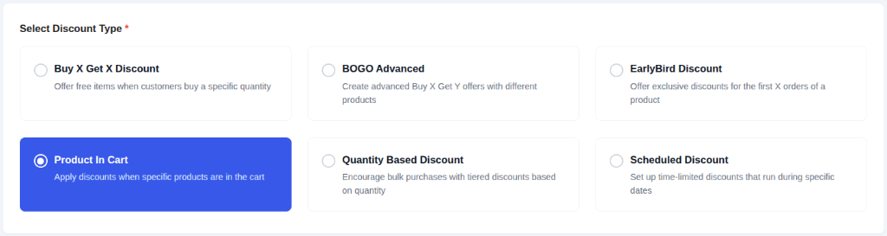
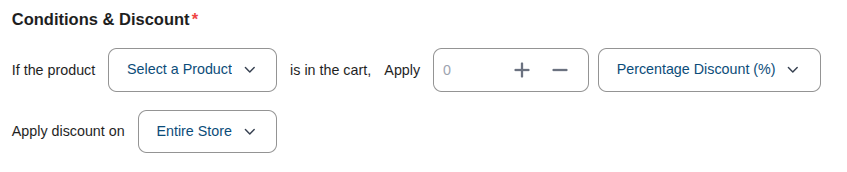
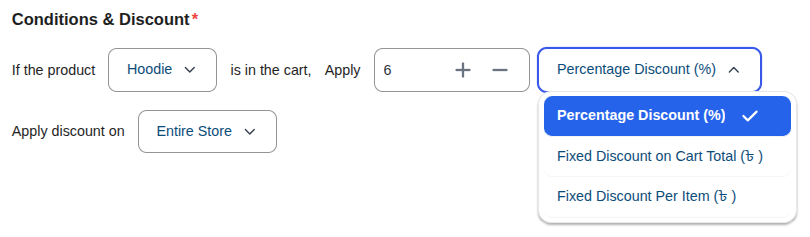
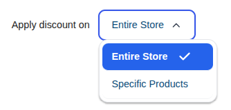
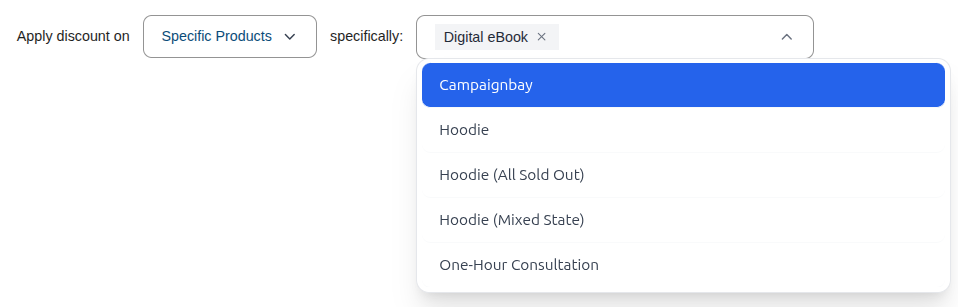
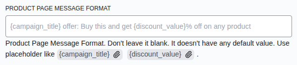

# Campaign Type: Product In Cart

The **Product In Cart** campaign is a conditional discount type. It allows you to offer a discount on specific items (or the entire cart) _only if_ a particular "trigger product" is present in the customer's cart.

This is ideal for membership-style perks or "lock and key" offers:

- "Buy this **Membership Card** and get **10% off everything** else."
- "Add a **Gift Box** to your cart to get **$5 off** your jewelry purchase."

## Step 1: Select Your Campaign Type

To begin, navigate to **CampaignBay → Add Campaign**.

- **Select Discount Type:** Choose **`Product In Cart`** from the list. This unlocks the conditional logic fields for trigger-based discounts.

- **Campaign Title:** Give your campaign a clear and descriptive name (e.g., "VIP Membership Perk").

- **Select Status:**
  - **Active:** The campaign will be live immediately (or on its scheduled start time).
  - **Inactive:** Save the campaign as a draft.

## Step 2: Define the Conditions & Discount

This campaign relies on a simple "If This, Then That" logic. You define which product triggers the discount and how that discount is applied.

### 1. The Trigger (If product...)

Select the **trigger product**. This is the item that must be in the customer's cart for the discount to activate.

- **Select a Product:** Search for and select the item (e.g., "VIP Membership").

### 2. The Discount (Apply...)

Enter the numeric **value** of the discount and choose the **Discount Type**:

- **Percentage Discount (%):** A percentage off the target items.
- **Fixed Discount on Cart Total:** A fixed amount off the total subtotal of the target items.
- **Fixed Discount Per Item:** A fixed amount off **every** individual target item in the cart.

### 3. The Target (Apply discount on...)

Choose which products are eligible for the discount once the trigger item is added:

- **Entire Store:** Every other item in the cart gets the discount.
- **Specific Products:** Only specific items or categories you choose will be discounted.

If you chose **Specific Products**, search for and select the eligible items in the secondary dropdown.

## Step 3: Set Conditions (Optional)

You can add specific rules to restrict who can use this discount.

**[Read the Full Guide: How to Use Conditions &rarr;](../core-concepts/conditions.md)**

## Step 4: Set Other Configurations (Optional)

This section provides additional rules for your campaign.

- **Exclude Sale Items:** Check this box if you do not want this campaign's discount to apply to products that are already on sale in WooCommerce. This is useful for preventing "double discounting."

- **Enable Usage Limit:** Check this box to set a maximum number of times this campaign can be used across your entire store. Once the limit is reached, the campaign will automatically become inactive.

## Step 5: Set the Schedule (Optional)

For a Scheduled Discount, setting the duration is essential. This section controls when your campaign will automatically start and end.

- **Start Time / End Time:** Use the date and time pickers to set the exact moment for the campaign to activate and expire.

::: tip Timezone Information
All dates and times are based on the timezone you have configured in your main WordPress settings under **Settings → General → Timezone**. The system automatically handles all UTC conversions for you.
:::

::: info Learn More About Automation
The status of your campaign is closely tied to the scheduling system, which uses WordPress Cron to automate activation and expiration.

**[Read the Full Guide: Scheduling & Automation &rarr;](../core-concepts/scheduling-and-automation.md)**
:::

## Step 6: Define Display Configurations

- **Show Product Page Message:** Toggle this to enable or disable the custom message on the target product pages.

- **Product Page Message Format:** Customize the text using placeholders like `{campaign_title}` and `{discount_value}`.
  - _Example:_ `{campaign_title} offer: Buy the VIP Pass and get {discount_value}% off this item!`

- **Cart Page Discount Message Format:** Enter a message to display on the cart page when the discount is applied.
- **Cart Page Message Location:** Choose where the cart message should appear.

## Step 7: Save the Campaign

Once you have configured all the options, click the **Save Campaign** button. You will be redirected to the "All Campaigns" list.

You have now learned about all campaign types. It's time to explore the global settings that control your entire discount system.

- **[Configuring the Settings &rarr;](../settings/index.md)**
