# Campaign Type: Quantity Based Discount

A **Quantity Based Discount** is a powerful tool for creating tiered pricing structures that reward customers for buying in bulk. This encourages larger order values by reducing the per-item cost as the quantity increases.

This is the perfect campaign type for scenarios like:

- "Buy 3 or more, get 10% off each"
- "Buy a case of 12 and get $2 off each bottle"
- Creating wholesale-style pricing for regular customers.

This guide will walk you through every field required to set up this campaign type.

## Step 1: Select Your Campaign Type

To begin, navigate to **CampaignBay → Add Campaign**.

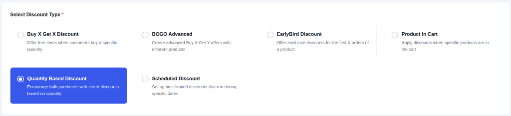

- **Select Discount Type:** Choose **`Quantity Based Discount`** from the list. This configures the campaign to apply tiered pricing based on the number of items purchased.

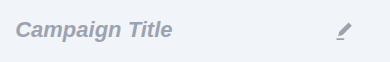

- **Campaign Title:** Give your campaign a clear and descriptive name (e.g., "T-Shirt Bulk Discount").

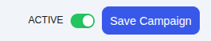

- **Select Status:**
  - **Active:** The campaign will be live as soon as its start time is reached.
  - **Inactive:** The campaign will be saved as a draft.

## Step 2: Set the Discount Target

This crucial step defines which products in your store are eligible for the quantity discount.

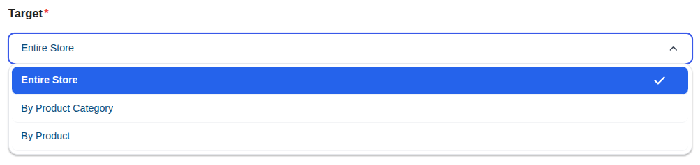

The **DISCOUNT TARGET** dropdown provides powerful options to control the scope of your campaign, such as applying it to the entire store, specific products, or categories.

::: info Learn More About Targeting
The "Discount Target" setting is a powerful feature shared by all campaign types. We've created a dedicated guide to explain all of its options and conditional fields in detail.

**[Read the Full Guide: Targeting &rarr;](../core-concepts/targeting.md)**
:::

## Step 3: Define Quantity Tiers

This is the core of the Quantity Based Discount. Here you will define the specific pricing levels for your promotion.

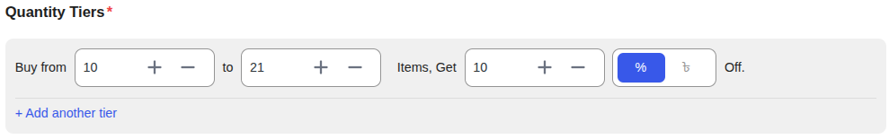

You can create one or more tiers. Each tier has the following fields:

- **Buy from:** The minimum quantity of an item a customer must have in their cart to qualify for this tier's discount.
- **to:** The maximum quantity for this tier. **Leave this blank** for the final tier to mean "and up" (e.g., 11 or more).
- **Items, Get:** The numeric value of the discount.
- **% / Fixed ($) (Mode):** The type of discount to apply.
  - **Percentage (%):** A percentage discount calculated on the price of each item.
  - **Fixed ($):** A fixed amount deducted from the price of **each individual item**.

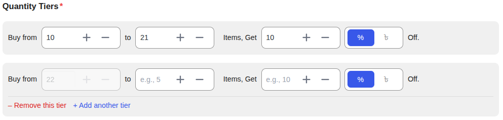

- **+ Add another tier:** Click this to add more pricing levels to your campaign.

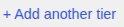

### Example Tier Setup

Here is an example of a multi-level discount for a product:

- **Tier 1:** Buy from `3` to `5` items, get `10` `%`
- **Tier 2:** Buy from `6` to `10` items, get `15` `%`
- **Tier 3:** Buy from `11` to ``items, get`20` `%`

## Step 4: Set Conditions (Optional)

You can add specific rules to restrict who can use this discount (e.g., specific User Roles).

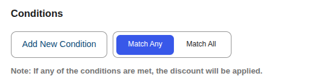

**[Read the Full Guide: How to Use Conditions &rarr;](../core-concepts/conditions.md)**

## Step 5: Set Other Configurations (Optional)

This section provides additional rules for your campaign.

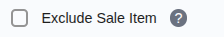

- **Exclude Sale Items:** Check this box if you do not want this campaign's discount to apply to products that are already on sale in WooCommerce. This is useful for preventing "double discounting."

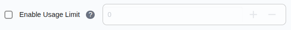

- **Enable Usage Limit:** Check this box to set a maximum number of times this campaign can be used across your entire store. Once the limit is reached, the campaign will automatically become inactive.

## Step 6: Set the Schedule (Optional)

For a Scheduled Discount, setting the duration is essential. This section controls when your campaign will automatically start and end.

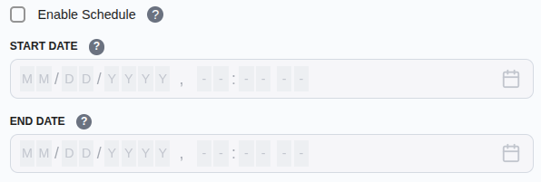

- **Start Time / End Time:** Use the date and time pickers to set the exact moment for the campaign to activate and expire.

::: tip Timezone Information
All dates and times are based on the timezone you have configured in your main WordPress settings under **Settings → General → Timezone**. The system automatically handles all UTC conversions for you.
:::

::: info Learn More About Automation
The status of your campaign is closely tied to the scheduling system, which uses WordPress Cron to automate activation and expiration.

**[Read the Full Guide: Scheduling & Automation &rarr;](../core-concepts/scheduling-and-automation.md)**
:::

## Step 7: Display Configurations

This section controls how the offer is communicated to the customer, both on the product page and in their cart.

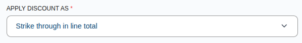

- **Apply Discount As:** Choose how the discount is displayed in the cart.
  - **Strike through in line total:** Shows the original price crossed out with the new quantity price next to it.

- **Cart Page Discount Message Format:** Enter a message to display on the cart page when the discount is applied.
  - _Example:_ `Quantity discount applied: {discount_amount}`

- **Cart Page Message Location:** Choose where the cart message should appear (e.g., next to the line item name).

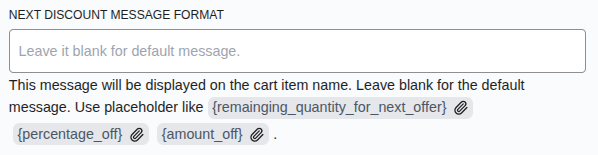

- **Next Discount Message Format:** Enter a custom message to be displayed on the cart item if the customer is close to unlocking the next discount tier. You can use placeholders like `{remainging_quantity_for_next_offer}`, `{percentage_off}`, and `{amount_off}`.

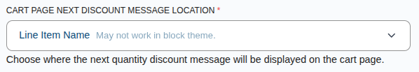

- **Cart Page Next Discount Message Location:** Choose where the "next discount" upsell message should appear on the cart page.

## Step 8: Save the Campaign

Once you have configured all the options, click the **Save Campaign** button at the top right of the page. After saving, you will be redirected back to the "All Campaigns" list.

## Next Steps

Next, learn how to create campaigns that reward your first customers.

- **[Creating an Early Bird Discount &rarr;](./early-bird-discounts.md)**
