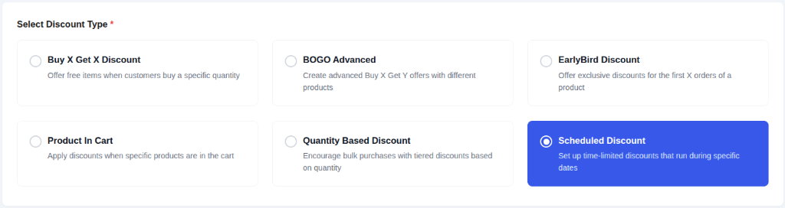
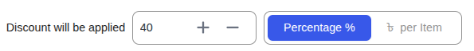
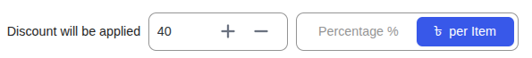
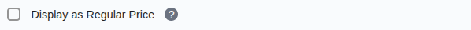
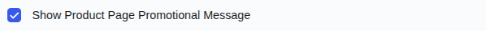
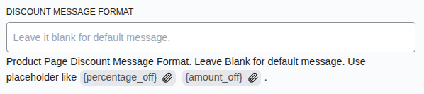

# Campaign Type: Scheduled Discount

A **Scheduled Discount** is the most common and straightforward type of campaign. It allows you to apply a direct price reduction (either a fixed amount or a percentage) to products for a specific, pre-defined period.

This is the perfect tool for running classic sales events like:

- Weekend Flash Sales
- Holiday Promotions (e.g., Black Friday, New Year's)
- Seasonal or End-of-Season Clearance Sales

This guide will walk you through creating a Scheduled Discount step by step.

## Step 1: Select Your Campaign Type

To begin, navigate to **CampaignBay → Add Campaign**.

- **Select Discount Type:** Choose **`Scheduled Discount`** from the list. This configures the campaign to apply a simple, direct price reduction.

- **Campaign Title:** Give your campaign a clear and descriptive name (e.g., "Summer Weekend Sale").

- **Select Status:**
  - **Active:** The campaign will be live as soon as its start time is reached.
  - **Inactive:** The campaign will be saved as a draft.

::: tip
For scheduled campaigns, set the Status to **Active** and enable the schedule. The system will display a **Scheduled** label in the campaign list until the start time is reached.
:::

## Step 2: Set the Discount Target

This crucial step defines which products in your store are eligible for the discount.

The **DISCOUNT TARGET** dropdown provides powerful options to control the scope of your campaign, such as applying it to the entire store, specific products, or categories.

::: info Learn More About Targeting
The "Discount Target" setting is a powerful feature shared by all campaign types. We've created a dedicated guide to explain all of its options and conditional fields in detail.

**[Read the Full Guide: Targeting &rarr;](../core-concepts/targeting.md)**
:::

## Step 3: Define the Discount Value

This is where you set the actual discount amount the customer will receive.

### 1. Percentage Discount

- **Percentage %:** Select this mode and enter the numeric value (e.g., `40`) to take a percentage off the product's price.

### 2. Fixed Amount Discount

- **Fixed ($) per Item:** Select this mode and enter the numeric value to deduct a fixed currency amount from **each individual item**.

## Step 4: Set Conditions (Optional)

You can add specific rules to restrict who can use this discount (e.g., specific User Roles).

**[Read the Full Guide: How to Use Conditions &rarr;](../core-concepts/conditions.md)**

## Step 5: Set Other Configurations (Optional)

This section provides additional rules for your campaign.

- **Exclude Sale Items:** Check this box if you do not want this campaign's discount to apply to products that are already on sale in WooCommerce. This is useful for preventing "double discounting."

- **Enable Usage Limit:** Check this box to set a maximum number of times this campaign can be used across your entire store. Once the limit is reached, the campaign will automatically become inactive.

## Step 6: Set the Schedule (Optional)

For a Scheduled Discount, setting the duration is essential. This section controls when your campaign will automatically start and end.

- **Start Time / End Time:** Use the date and time pickers to set the exact moment for the campaign to activate and expire.

::: tip Timezone Information
All dates and times are based on the timezone you have configured in your main WordPress settings under **Settings → General → Timezone**. The system automatically handles all UTC conversions for you.
:::

::: info Learn More About Automation
The status of your campaign is closely tied to the scheduling system, which uses WordPress Cron to automate activation and expiration.

**[Read the Full Guide: Scheduling & Automation &rarr;](../core-concepts/scheduling-and-automation.md)**
:::

## Step 7: Display Configurations

This section controls how the offer is communicated to the customer, both on the product page and in their cart.

- **Display as Regular Price:** If checked, the discounted price will be shown as the regular price on the product page, rather than showing a "sale" price with a strikethrough.

- **Show Product Page Promotional Message:** Toggle this to enable or disable the custom message on the product pages.

- **Product Page Discount Message Format:** Customize the promotional text using placeholders like `{percentage_off}` or `{amount_off}`.
  - _Example:_ `Flash Sale! Get {percentage_off}% off today!`

- **Cart Page Discount Message Format:** Enter a message to display on the cart page when the discount is applied.
  - _Example:_ `Discount applied: {discount_amount}`

- **Cart Page Message Location:** Choose where the cart message should appear (e.g., next to the line item name).

## Step 8: Save the Campaign

Once you have configured all the options, click the **Save Campaign** button at the top right or the **Save Changes** button at the bottom of the page. After saving, you will be redirected back to the "All Campaigns" list, where you can see your new campaign.

## Next Steps

Now that you've mastered the Scheduled Discount, learn how to create campaigns that reward customers for buying in bulk.

- **[Creating a Quantity Based Discount &rarr;](./quantity-discounts.md)**
