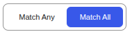
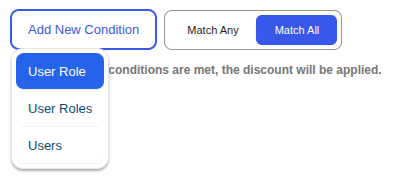
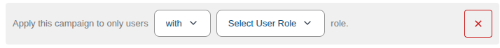
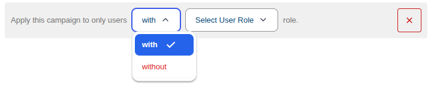
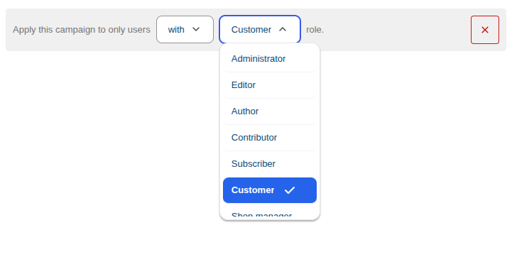
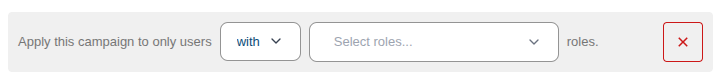
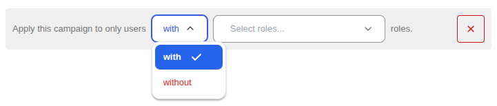
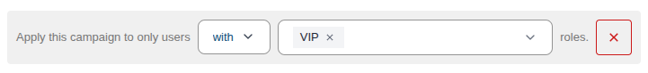
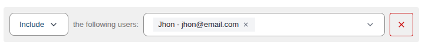
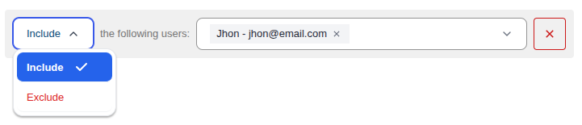

# Conditions

Campaign Bay allows you to add **Conditions** to any campaign. These conditions "gate" the discount, ensuring it only applies when specific criteria are met.

---

## How Conditions Work

Every campaign includes a **Conditions** section where you can add one or more rules.

### Match Logic

| Mode          | Behavior                                             |
| ------------- | ---------------------------------------------------- |
| **Match Any** | Discount applies if _at least one_ condition is true |
| **Match All** | Discount applies _only if all_ conditions are true   |

### Adding Conditions

Click **Add New Condition** to see the available options:

---

## Available Conditions

### 1. User Role (Single)

Restrict the campaign to users with a **single specific** WordPress role.

#### With / Without Toggle

| Option      | Behavior                                                  |
| ----------- | --------------------------------------------------------- |
| **with**    | Only users _with_ the selected role can use this discount |
| **without** | Users _without_ the selected role can use this discount   |

#### Select User Role

Choose from any WordPress role on your site:

- Administrator, Editor, Author, Contributor, Subscriber
- WooCommerce roles: Customer, Shop Manager
- Custom roles from other plugins

::: tip Use Case
Create a "VIP Only" sale: `User Role` → `with` → `VIP Customer`
:::

---

### 2. User Roles (Multiple)

Restrict the campaign to users with **one of several** WordPress roles.

#### With / Without Toggle

| Option      | Behavior                                                          |
| ----------- | ----------------------------------------------------------------- |
| **with**    | Only users with _any_ of the selected roles can use this discount |
| **without** | Users _without any_ of the selected roles can use this discount   |

#### Multi-Select Roles

Select multiple roles — user must have **at least one** of the selected roles.

::: tip Use Case
Create a wholesale discount: `User Roles` → `with` → `Wholesale Buyer, VIP Customer`
:::

---

### 3. Users (Specific)

Restrict the campaign to **specific individual users** by name or email.

#### Include / Exclude Toggle

| Option      | Behavior                                                   |
| ----------- | ---------------------------------------------------------- |
| **Include** | Only the selected users can use this discount              |
| **Exclude** | Everyone _except_ the selected users can use this discount |

#### Multi-Select Users

Select multiple users from the dropdown — search by name or email.

::: tip Use Case
Create a personal thank-you discount for top customers: `Users` → `Include` → `john@example.com, jane@example.com`
:::

---

## Next Steps

Now that you know how to apply specific rules to users and roles, learn how to target your discounts to specific products and categories.

- **[Targeting &rarr;](./targeting.md)**
