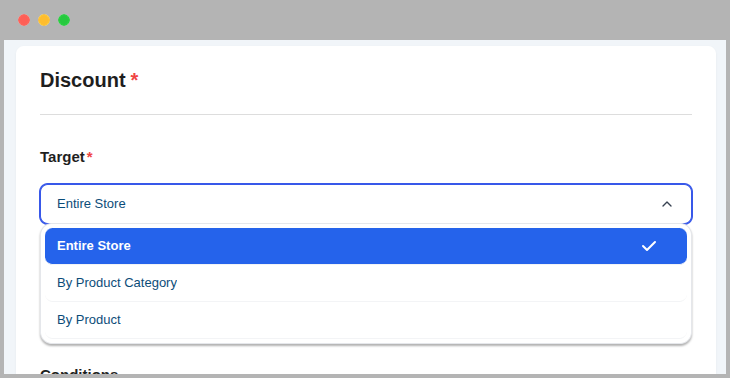
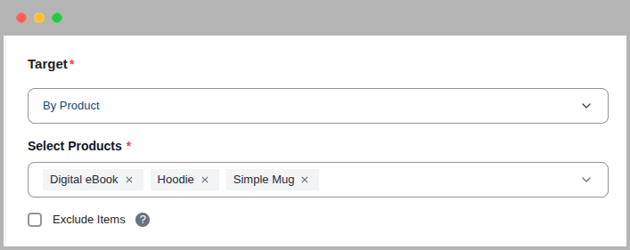
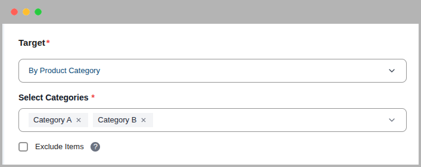
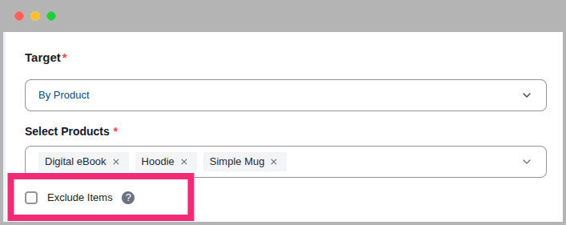

# Core Concepts: Targeting

One of the most powerful features of CampaignBay is the ability to precisely control which products are eligible for a discount. The **Discount Target** setting, which appears on the "Add/Edit Campaign" screen, is the primary tool for defining this scope.

This guide provides a detailed explanation of each available targeting option.

## Targeting Options Overview

When you create or edit any campaign, you will see the "DISCOUNT TARGET" dropdown menu. This is where you select the core logic for how the plugin will find eligible products.

There are three primary methods for targeting your discounts:

1.  Entire Store
2.  By Product
3.  By Product Category

Let's explore each option in detail.

### 1. Entire Store

- **What it does:** This is the broadest and simplest option. When selected, the campaign's discount will be applied to **every single product** in your WooCommerce store (unless excluded by other campaign rules like "Exclude Sale Items").
- **Best for:** Store-wide sales events like Black Friday, Cyber Monday, anniversary sales, or any promotion where you want to offer a discount on everything.
- **Configuration:** No further configuration is needed. Simply select this option.

### 2. By Product

- **What it does:** This is the most specific targeting option. It allows you to hand-pick individual products that will be included in (or excluded from) the discount.
- **Best for:** Promoting a new product, running a "Deal of the Week" on a specific item, or clearing out the remaining stock of a few specific products.
- **Configuration:** When selected, a **"Select Products"** field will appear.

- **Select Products:** Click inside the box and start typing the name of a product to search. Select one or more products from the list. If you select a **variable product**, the rule will apply to all of its variations.
- **Exclude Items:** This powerful checkbox inverts the logic.
  - **Unchecked (Default):** The discount will apply **only** to the products you selected.
  - **Checked:** The discount will apply to **all products in your store EXCEPT** for the ones you selected.

### 3. By Product Category

- **What it does:** This option allows you to apply a discount to all products that belong to one or more specific categories.
- **Best for:** Targeted promotions, such as "15% off all T-Shirts" or a clearance sale on your "Electronics" and "Accessories" categories.
- **Configuration:** When you select this option, a **"Select Categories"** field will appear.

- **Select Categories:** Click inside the box and start typing the name of a category to search. Select one or more categories from the list. The discount will apply to all products within the selected categories (including their sub-categories).
- **Exclude Items:** This checkbox inverts the logic.
  - **Unchecked (Default):** The discount will apply **only** to products within the categories you selected.
  - **Checked:** The discount will apply to **all products in your store EXCEPT** for those in the categories you selected.

## Inverting the Logic: The 'Exclude Items' Checkbox

For both "By Product" and "By Product Category" targeting, you will see an **`Exclude Items`** checkbox. This is a powerful feature that completely inverts the logic of your selection, allowing you to create store-wide discounts with a few specific exceptions.

#### Default Behavior (Exclude Items is UNCHECKED)

- The discount will apply **ONLY** to the items you have selected in the box.
- This is an **"include list"**. All other products are ignored.

#### Inverted Behavior (Exclude Items is CHECKED)

- The discount will apply to **EVERYTHING in your store EXCEPT** for the items you have selected in the box.
- This is an **"exclude list"**.

### Practical Use Cases for "Exclude Items"

**Example 1: Store-wide Sale, Excluding a New Product**

- **Goal:** Run a 15% off sale on everything, but keep your brand new, full-priced flagship product excluded.
- **Setup:**
  1.  **Discount Target:** `By Product`
  2.  **Select Products:** Search for and select your "Flagship Product".
  3.  **Exclude Items:** **Check this box.**
- **Result:** The 15% discount will apply to every product in your store _except_ the flagship product.

**Example 2: Discount All Clothing, Except for "New Arrivals"**

- **Goal:** Put all clothing on sale, but exclude the items in your "New Arrivals" category.
- **Setup:**
  1.  **Discount Target:** `By Product Category`
  2.  **Select Categories:** Search for and select the "New Arrivals" category.
  3.  **Exclude Items:** **Check this box.**
- **Result:** The discount will apply to every product in your store _except_ for those in the "New Arrivals" category.

## Next Steps

Now that you've configured your settings, head to the FAQ for common questions and answers.

- **[FAQ &rarr;](../faq.md)**
