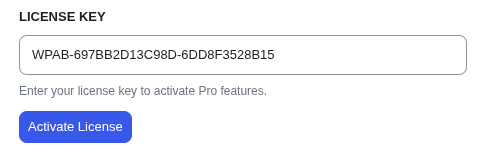

# Advanced Settings

The **Advanced Settings** tab contains options for data management and license activation.

## Data Management

### Delete All Data on Uninstall

> [!CAUTION]
> This is a destructive action. Only enable this if you want to completely remove all CampaignBay data.

- **Checked:** When you uninstall the plugin, a cleanup script will **permanently delete** all associated database tables and options.
- **Unchecked:** Your campaign data will be preserved if you reinstall the plugin later.

---

## License Management

### License Key

Enter the license key you received upon purchase of CampaignBay Pro.

### Activate License

Click to validate your key and unlock Pro features. Once activated, your license status will show as active.

### Deactivate License

If you need to migrate your license to another domain, click **Deactivate License** to release it from the current site before activating on a new one.

---

## Next Steps

Now that you've configured your settings, head to the FAQ for common questions and answers.

- **[FAQ &rarr;](../faq.md)**
