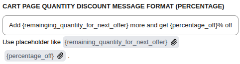
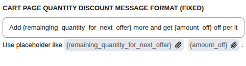
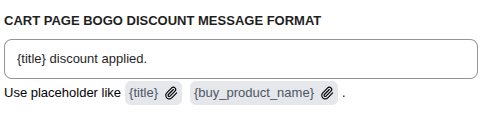
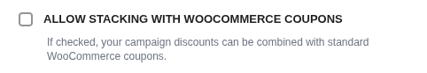

# Cart Settings

The **Cart Settings** tab manages how discounts are communicated and calculated within the WooCommerce cart and checkout flow.

## Cart Page Display

### Message Formats

Configure the upsell and discount messages that appear in the cart for different campaign types.

#### Quantity Discount (Percentage)

| Placeholder                           | Description                         |
| ------------------------------------- | ----------------------------------- |
| `{remaining_quantity_for_next_offer}` | Items needed to reach the next tier |
| `{percentage_off}`                    | Discount percentage at next tier    |

**Example:** `Add {remaining_quantity_for_next_offer} more and get {percentage_off}% off`

#### Quantity Discount (Fixed)

| Placeholder                           | Description                         |
| ------------------------------------- | ----------------------------------- |
| `{remaining_quantity_for_next_offer}` | Items needed to reach the next tier |
| `{amount_off}`                        | Fixed discount amount at next tier  |

**Example:** `Add {remaining_quantity_for_next_offer} more and get {amount_off} off per it`

#### BOGO Discount

| Placeholder          | Description                    |
| -------------------- | ------------------------------ |
| `{title}`            | Campaign title                 |
| `{buy_product_name}` | Name of the qualifying product |

**Example:** `{title} discount applied.`

---

## Cart Discount Options

### Allow Stacking with WooCommerce Coupons

- **Checked:** Campaign discounts can be combined with standard WooCommerce coupons.
- **Unchecked:** The two discount systems are mutually exclusive.

### Allow Stacking with Other Discount Campaigns

Controls whether different _types_ of CampaignBay campaigns can be applied together on the same cart.

- **Checked:** Multiple active discount campaigns can apply to the same cart.
- **Unchecked:** Only the single best overall discount applies.

::: info Learn More
The order and logic for how campaigns are stacked is very specific.

**[Read the Full Guide: The Discount Engine & Stacking &rarr;](../core-concepts/understanding-the-engine.md#step-2-stacking-between-discount-groups)**
:::

---

## Next Steps

Continue exploring advanced data management and licensing options.

- **[Advanced Settings &rarr;](./advanced-settings.md)**
