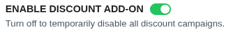
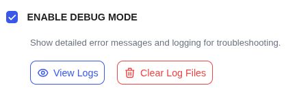

# Global Settings

The **Global Settings** tab contains the main operational controls for the entire plugin, affecting how discounts are calculated and displayed across your store.

## Global Options

### Enable Discount Add-on

This is the master "on/off" switch for CampaignBay.

- **ON (Green):** The plugin is active and will apply discounts to your store.
- **OFF (Grey):** The entire pricing engine is disabled. No discounts will be calculated or applied. This is a quick way to temporarily pause all campaigns.

### Bulk Table Position

Controls where the "Quantity Discount" pricing table appears on product pages.

| Option         | Placement                               |
| -------------- | --------------------------------------- |
| **Below Cart** | Directly below the "Add to Cart" button |
| **Above Cart** | Directly above the "Add to Cart" button |
| **Below Meta** | Below product metadata (SKU, Category)  |
| **Above Meta** | Above product metadata                  |

### Discount Bar Position

Controls where promotional bars (for Scheduled or BOGO discounts) appear on product pages.

| Option         | Placement                       |
| -------------- | ------------------------------- |
| **Below Cart** | Below the "Add to Cart" section |
| **Above Cart** | Above the "Add to Cart" section |
| **Below Meta** | Below the product metadata      |
| **Above Meta** | Above the product metadata      |

### Calculate Discount From

Determines which price is used as the base for discount calculations.

- **Regular Price:** Always calculates from the product's original price, ignoring any existing WooCommerce sales.
- **Sale Price:** If a product is already on sale in WooCommerce, the discount is calculated from that reduced price (prevents deep stacking).

## Debugging & Logging

### Enable Debug Mode

When checked, the plugin logs detailed process information for troubleshooting.

Once enabled, two action buttons appear:

- **View Logs:** Opens the Debug Log Viewer modal.
- **Clear Log Files:** Purges all current log history.

### Debug Log Viewer

The log viewer provides:

- **Select Log Date:** Choose which day's logs to view.
- **Refresh:** Reload the current log file.
- **Download:** Save the log file locally for sharing with support.
- **Clear Log Files:** Permanently delete all log entries.

::: tip
Enable Debug Mode when diagnosing issues. Remember to disable it in production to avoid performance overhead.
:::

---

## Next Steps

Continue exploring the settings for products and messaging.

- **[Product Settings &rarr;](./product-settings.md)**
