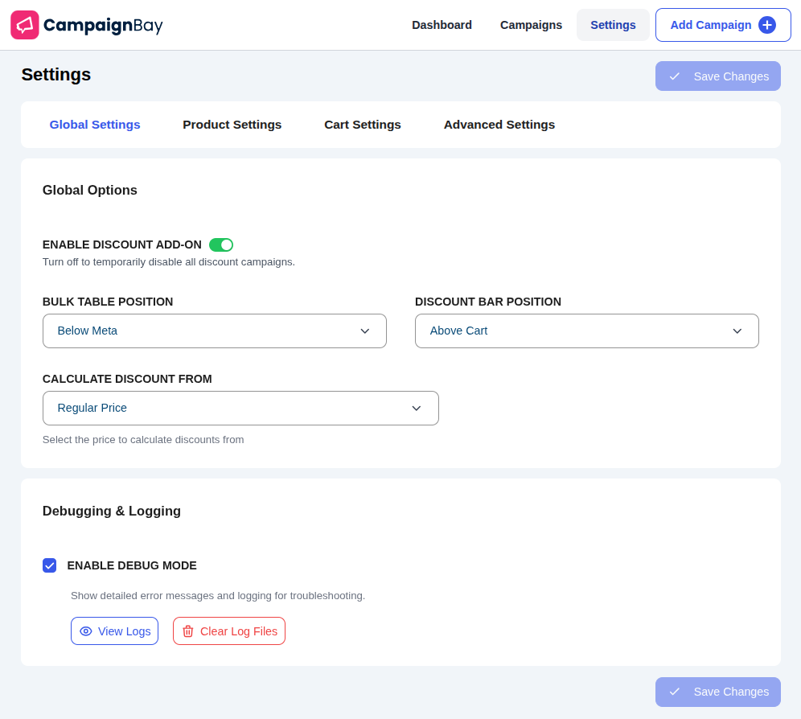

# Settings

The Settings page contains all the global configuration options for the CampaignBay plugin. These settings control the default behavior of the discount engine, display options, and more.

The settings are organized into **four tabs**. Click any tab below to view its detailed documentation:

| Tab                                             | Description                                               |
| ----------------------------------------------- | --------------------------------------------------------- |
| [**Global Settings**](./global-settings.md)     | Master controls, display positions, and calculation logic |
| [**Product Settings**](./product-settings.md)   | Product page messaging and discount prioritization        |
| [**Cart Settings**](./cart-settings.md)         | Cart messaging and stacking rules                         |
| [**Advanced Settings**](./advanced-settings.md) | Data management and cleanup options                       |

After making changes on any tab, click the **Save Changes** button to apply them.
