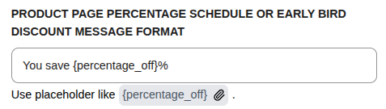
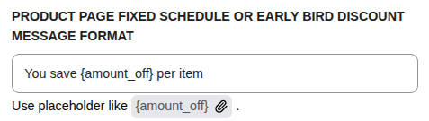
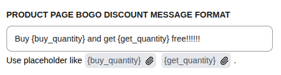
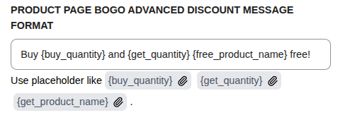
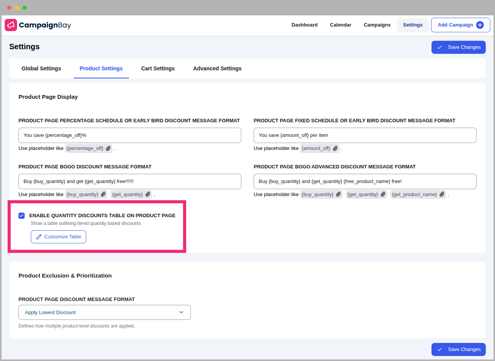
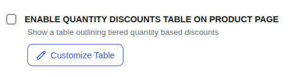

# Product Settings

The **Product Settings** tab controls how discounts and promotional messaging appear on your individual product pages.

## Message Formats

Customize how promotional messages are displayed on product pages for different campaign types.

### Percentage Schedule / Early Bird Discount

**Placeholder:** `{percentage_off}` — The percentage discount value.

**Example:** `You save {percentage_off}%`

### Fixed Schedule / Early Bird Discount

**Placeholder:** `{amount_off}` — The fixed amount discount.

**Example:** `You save {amount_off} per item`

### BOGO Discount

| Placeholder      | Description                |
| ---------------- | -------------------------- |
| `{buy_quantity}` | Quantity customer must buy |
| `{get_quantity}` | Quantity customer receives |

**Example:** `Buy {buy_quantity} and get {get_quantity} free!!!!!!`

### BOGO Advanced Discount

| Placeholder           | Description                |
| --------------------- | -------------------------- |
| `{buy_quantity}`      | Quantity customer must buy |
| `{get_quantity}`      | Quantity customer receives |
| `{free_product_name}` | Name of the free product   |

**Example:** `Buy {buy_quantity} and {get_quantity} {free_product_name} free!`

---

## Quantity Discounts Table

### Enable Quantity Discounts Table on Product Page

When enabled, a pricing table showing tiered discounts will appear on product pages for Quantity-based campaigns.

### Customize Discount Table

Click **Customize Table** to open the configuration modal:

| Setting               | Description                                                            |
| --------------------- | ---------------------------------------------------------------------- |
| **Show Table Header** | Toggle visibility of column header row                                 |
| **Title Column**      | Enable/disable and customize the campaign title column                 |
| **Range Column**      | Enable/disable and customize the quantity range column                 |
| **Discount Column**   | Enable/disable, customize label, and choose content (Price/Percentage) |

The **Preview** section shows a live preview of how the table will appear.

---

## Product Prioritization

Defines the logic when multiple discounts could apply to the same product:

| Option                     | Behavior                                              |
| -------------------------- | ----------------------------------------------------- |
| **Apply Highest Discount** | Uses the campaign giving the biggest price reduction  |
| **Apply Lowest Discount**  | Uses the campaign giving the smallest price reduction |
| **Apply First Match**      | Applies the first matching campaign by priority order |

::: info
This setting only applies when campaign stacking is disabled. If stacking is enabled, discounts can be layered according to the stacking rules.
:::

---

## Next Steps

Continue exploring the settings for cart and stacking logic.

- **[Cart Settings &rarr;](./cart-settings.md)**
